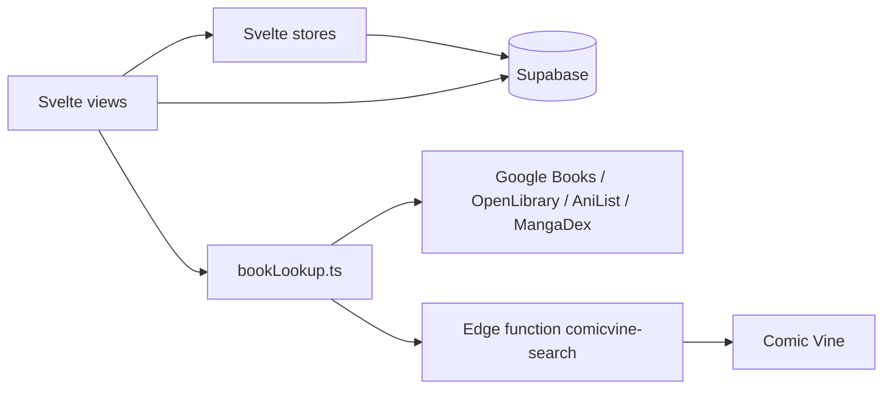

# Architecture

## Stack

- TypeScript on Vite, UI in Svelte 5 (runes only), styled with Tailwind. No meta-framework, no SSR: the app is a static SPA.
- Supabase is the whole backend: Postgres, auth, storage, and one edge function. There is no server of our own.
- `vite-plugin-pwa` turns the build into an installable, offline-capable PWA (`autoUpdate` service worker).

## How it fits together

## Key decisions

- No router and no component library. Navigation is a single `currentView` store (`src/lib/nav.ts`) switched on in `App.svelte`; adding a screen means adding a variant and a branch.
- No data layer or client cache. Views query Supabase directly; `booksStore` is only a read-only mirror of what `Collection.svelte` loaded, so the sidebar can show real counts without a second query.
- Book metadata is never trusted to one source. `bookLookup.ts` fans out to several APIs and merges, because no single one covers French novels, manga and comics at once.
- Comic Vine is proxied through a Supabase edge function purely because it sends no CORS headers.
- Device-local preferences (theme, reading goal) live in `localStorage`, not in Postgres — they are per-device, not per-library.

- Logic worth testing is pulled out of the `.svelte` files into `src/lib/*.ts`. `addBook.ts` (category guessing, series grouping, row building) and `scanner.ts` (camera lifecycle, shared by the two places that scan) came out of `AddBook.svelte` for that reason.

## Gotchas

- Svelte 5 runes only. `export let` and `$:` are forbidden (see `DESIGN_GUIDELINES.md`).
- Modules under `src/lib/` are imported with an explicit `.ts` extension where a test reaches them: Vite resolves either form, Node's test runner requires the extension.
- Barcode scanning needs HTTPS; it works on `localhost` in dev, and nowhere else without TLS.
