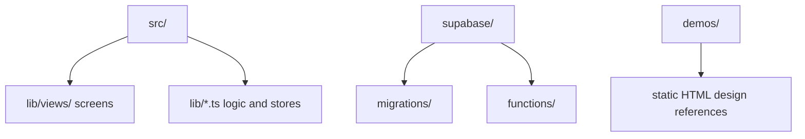

# Codebase Map

## Areas

- `src/lib/views/`: every screen and shell component, flat. Mostly one file per screen; the overlays that carry their own state and lifecycle are their own components (`BookPreviewModal`, `VolumeCoverPicker`), and `CoverFallback` is the shared no-cover placeholder.
- `src/lib/*.ts`: all non-UI logic — Supabase client and row types, auth, navigation, external book lookup, series parsing, the add-flow logic (`addBook.ts`), the barcode scanner lifecycle (`scanner.ts`), category styling, and the Svelte stores.
- `src/lib/*.test.ts`: unit tests, beside the module they cover.
- `supabase/migrations/`: the authoritative schema history. `supabase/schema.sql` is a convenience snapshot and lags behind.
- `supabase/functions/comicvine-search/`: the only server-side code, a Deno CORS proxy.
- `demos/`: standalone HTML mockups the UI is meant to match. Not built or shipped.
- `public/`: PWA icons and static assets.

## Entry points

- `src/main.ts` mounts `src/App.svelte`, which owns the auth gate and the view switch.
- `index.html` is the Vite entry.
