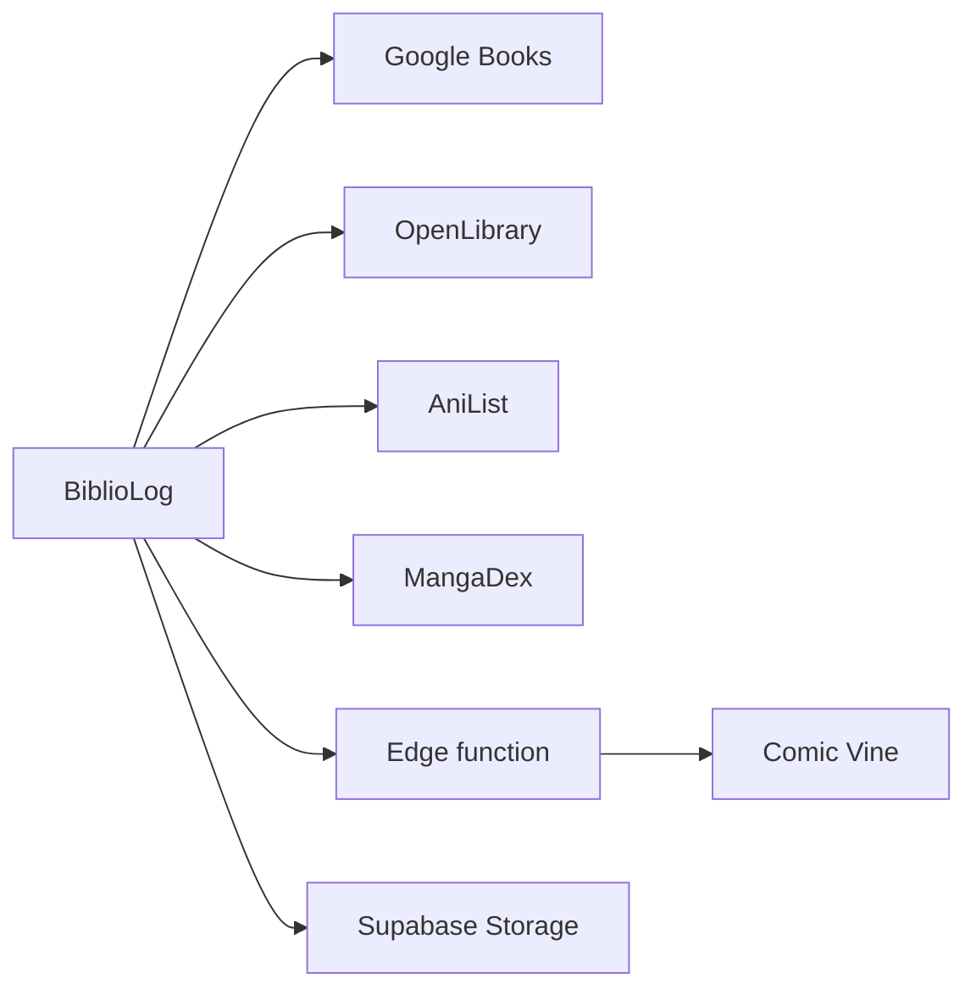

# Integration

## External services

All book metadata comes from public APIs, orchestrated in `src/lib/bookLookup.ts`. None is authoritative on its own, so lookups fan out and the results are merged and deduplicated.

- **Google Books**: main title and ISBN search, French-biased (`langRestrict=fr`). `VITE_GOOGLE_BOOKS_API_KEY` is optional and only raises the quota.
- **OpenLibrary**: ISBN and title fallback, and a cover source.
- **AniList** (GraphQL): manga series, used notably to get a series' total volume count.
- **MangaDex**: per-volume manga covers.
- **Comic Vine**: comics issues, reached only through the edge function.
- **Supabase Storage** (`covers` bucket): manually uploaded covers when no API finds the book.

## Conventions

- Every outbound call goes through the `fetchJson` helper, which adds an `AbortController` timeout — `fetch` has none, and one slow source would otherwise hang the whole search.
- Per-source latency and success are tracked (`SearchLatencies`) and surfaced in the UI, so a degraded source is visible rather than silent.
- Google Books thumbnail URLs are rewritten to https and upgraded out of the default curled-corner zoom level.
- Common acronyms (`mha`, `jjk`, `lotr`) are expanded to full titles before querying, since the APIs do not recognise them.
