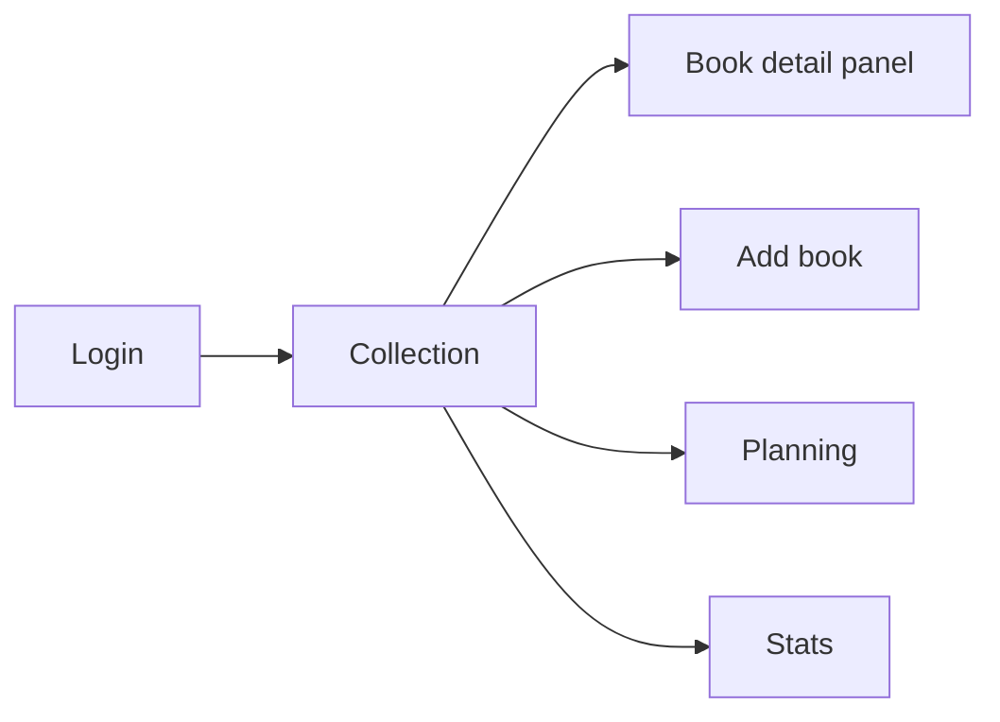

# Navigation

## Routing

- No router. `src/lib/nav.ts` exports a `currentView` store holding a tagged union (`collection`, `planning`, `stats`, `add`, `book`), and `App.svelte` switches on it. The URL never changes, which is deliberate for a home-screen PWA but means no deep links and no back button.
- Access control is a gate in `App.svelte`, not per-route: no session renders `Login`, a `PASSWORD_RECOVERY` event renders `ResetPassword`, and everything else is behind that.
- `TopNav.svelte` renders as a desktop sidebar and a mobile bottom bar from the same component.

## Structure

- `book` is an overlay panel rendered on top of the current screen, not a replacement for it.
